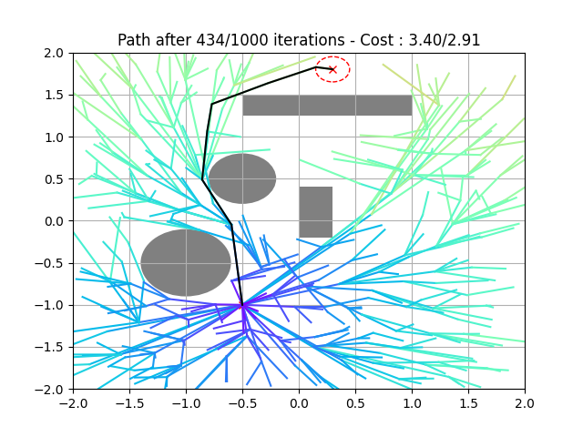

# RRT / RRT*

Python implementation of the RRT* algorithm, with usage example that allows to vizualize the algorithm's searching steps. The current implementation allows to create 2D environment with rectangular and circular obstacles between the current and target positions. A small Matlab implementation is also provided. 
